# ComfyUI-NTX-support-nodes

A collection of custom nodes for ComfyUI. All nodes are registered with the `NTX` prefix
(e.g. *NTX Pipe Custom*) and appear under the **NTX-support-nodes** category in the node menu.
The right-click menu entries added by the addon carry the same prefix; it is omitted
throughout this document.

Configuration and data files (prompt library, custom pipe templates, `config.json`) are read
from `input/ntx_data/` inside the ComfyUI folder (falling back to the `ntx_data/` folder
bundled with the addon).

Recurring data type: **LORA_STACK** — a list of `(lora_name, strength_model, strength_clip)`
tuples, passed between the LoRA nodes below.

---

## PipeCustom

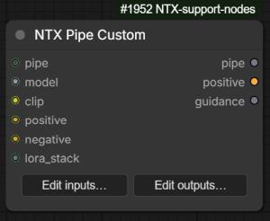

A "pipe" node used to bundle many values into a single wire. The pipe itself is a dictionary
(`DICT` type): every connected input is stored in the dictionary under the input's name, and
every output reads the value with the same name back out of the dictionary. The set of custom
inputs and outputs is defined per-node by the user through an editor dialog, and inputs and
outputs are configured **independently** — a node may, for example, only add values to the pipe
(inputs only) or only extract them (outputs only).

### Inputs

| Input | Type | Description |
|---|---|---|
| `pipe` | DICT (optional) | An upstream pipe to extend. If omitted, a new empty pipe is created. The input pipe is cloned, so downstream changes never affect the upstream dictionary. |
| `inputs_data` | STRING (hidden) | JSON produced by the editor dialog describing the configured inputs/outputs (`{"inputs": [...], "outputs": [...]}`). Managed entirely by the frontend; not edited by hand. |
| *custom inputs* | user-defined | One slot per configured input, with the chosen name and type. Only connected (non-None) values are written into the pipe. |

### Outputs

| Output | Type | Description |
|---|---|---|
| `pipe` | DICT | The merged pipe dictionary (input pipe + values from the connected custom inputs). |
| *custom outputs* | user-defined | One slot per configured output; each returns `pipe[name]`. If the name is not present in the pipe, a per-type default is returned (`0` for INT, `0.0` for FLOAT, `""` for STRING, `False` for BOOLEAN, `[]` for LORA_STACK / CONTROL_NET_STACK / LIST, `{}` for DICT, `None` otherwise). |

Up to **30** custom inputs and 30 custom outputs per node. The names `pipe` and `inputs_data`
are reserved and cannot be used for custom entries.

### Frontend

The node body shows two buttons, **Edit inputs…** and **Edit outputs…**, which open the editor
dialog for the corresponding side. In the dialog:

- **+ Add** appends a new entry; each row has a name field and a type dropdown
  (IMAGE, MASK, LATENT, MODEL, CLIP, VAE, CONDITIONING, INT, FLOAT, STRING, BOOLEAN,
  LORA_STACK, CONTROL_NET_STACK, DICT, LIST, `*`).
- Rows can be **drag-reordered** with the handle and removed with **✕**.
- **Renaming** a row keeps its slot and any connected wires — only removing a row (or changing
  its type) drops the wire. A rename is also propagated to the entry with the same name on the
  other side (inputs ↔ outputs), so the pipe key keeps matching end to end; an info toast lists
  the propagated renames. Propagation is skipped if the new name is already taken on that side.
- **Copy from inputs/outputs** replaces the list with the entries of the other side.
- **Load template…** opens a picker with predefined property sets loaded from
  `input/ntx_data/custompipe_configs.txt`; the chosen template's properties are appended,
  skipping names already present.
- **Save as template…** stores the current list as a named template in the same file, so it can
  be reloaded later on any PipeCustom node. If the name is already taken, the button changes to
  **Overwrite** and a second click is required to replace the existing template.
- Names are validated on OK (non-empty, no duplicates, no reserved names). If a name exists on
  both sides with different types, a warning toast is shown.
- **Enter** (while editing a name) confirms, **Escape** cancels.

Right-click menu options on the node:

- **Edit pipe inputs…** / **Edit pipe outputs…** — same as the two buttons.
- **Split custom pipe** — creates a second PipeCustom node to the right, moves all custom
  outputs (and their outgoing links) onto it, connects the original's `pipe` output to the new
  node's `pipe` input, and shifts the downstream nodes/groups to make room. The original node
  keeps only its inputs.
- **Merge custom pipes** — the reverse: merges the right-clicked node back into the
  upstream PipeCustom it is connected to (the source takes over the target's outputs and
  outgoing links, the target is deleted and downstream nodes are shifted back). Requires the
  target to have no non-pipe inputs connected and the source no non-pipe outputs connected.

---

## LoraStack

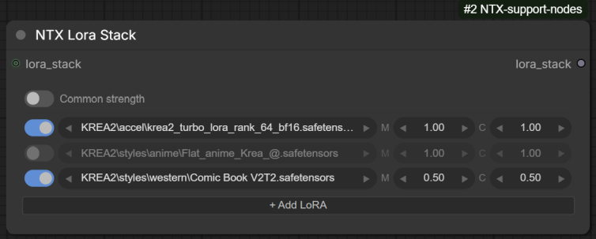

Builds a LORA_STACK from a list of LoRAs configured directly on the node through a custom
widget (no model is loaded here — combine with **ApplyLoraStack** to actually apply the stack).

### Inputs

| Input | Type | Description |
|---|---|---|
| `loras_data` | STRING (hidden) | JSON serialisation of the widget state (`{"commonStrength": bool, "loras": [{enabled, name, modelStrength, clipStrength}, ...]}`). Managed by the frontend widget. A bare JSON array (the old format) is still accepted. |
| `lora_stack` | LORA_STACK (optional) | An upstream stack to extend; the configured LoRAs are appended to it. |

### Outputs

| Output | Type | Description |
|---|---|---|
| `lora_stack` | LORA_STACK | The input stack (if any) plus one entry per **enabled** row with a real LoRA selected (rows set to `none` are skipped). When *Common strength* is on, the model strength is also used as the clip strength. |

### Frontend

The `loras_data` widget is replaced by a custom LoRA list UI:

- **Common strength** toggle in the header: when on, the clip strength column is hidden and the
  model strength is used for both.
- Each row: a drag handle (⠿, drag to reorder), an on/off toggle, the LoRA name, and *M* (model) /
  *C* (clip) strength widgets. The strength pills step ±0.05 with the ◀ ▶ arrows (CTRL+click for
  ±0.01) and scrub on horizontal drag (CTRL for fine steps); a plain click on the value opens an
  input box to type it directly (Enter or clicking away confirms, Escape cancels).
- Clicking the LoRA name opens a flat dropdown with a live filter box; the ◀ ▶ arrows next to
  the name step to the previous/next LoRA in the list.
- The 📂 button (or **Shift+click** on the LoRA name) opens a **tree selector** organised by
  subfolder, with a search box, **Refresh** button (re-scans the loras folder on disk via the
  `reload_loras_list` backend route), OK/Cancel, double-click to confirm, and Enter/Escape keys.
- Rows referencing a file that is **missing** from the loras folder get a red outline; rows that
  **duplicate** an earlier entry (which ApplyLoraStack would skip) get an amber outline. The
  tooltip on the name explains the warning.
- **+ Add LoRA** appends a row; **right-click on a row** offers *Delete*, *Move up*, *Move down*
  plus the stack-level actions; **right-click elsewhere** on the widget (header, add button)
  opens the stack-level menu directly: *Enable all*, *Disable all*, *Remove disabled*,
  *Copy stack as text* and *Paste from text*.
- **Copy stack as text** puts the enabled rows on the clipboard in `<lora:name:model[:clip]>`
  format (one per line); **Paste from text** parses any text containing such tags and appends
  the entries, matching names against the known list (a missing extension defaults to
  `.safetensors`, and bare basenames are resolved against subfolders).

Right-click menu options on the node:

- **Rebuild LoraStack UI** — recreates the custom widget in place (recovery for the rare
  case where the node deserialises with the raw-JSON fallback widget).
- **Reload Lora List from disk** — re-scans the loras folder on the backend and rebuilds
  the widget so the fresh list is available immediately.

---

## MergeLoraStacks

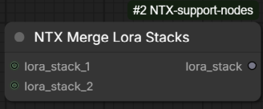

Concatenates two LORA_STACKs into one.

### Inputs

| Input | Type | Description |
|---|---|---|
| `lora_stack_1` | LORA_STACK (optional) | First stack; its entries come first in the result. |
| `lora_stack_2` | LORA_STACK (optional) | Second stack; appended after the first. |

### Outputs

| Output | Type | Description |
|---|---|---|
| `lora_stack` | LORA_STACK | All entries of stack 1 followed by all entries of stack 2. Missing inputs are treated as empty. |

---

## ApplyLoraStack

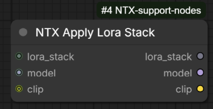

Applies every LoRA in a stack to a model (and optionally a CLIP), with duplicate detection,
an in-memory file cache, and optional download of missing files from cloud storage.

For each `(name, strength_model, strength_clip)` entry:

- entries with both strengths equal to 0 are skipped;
- a LoRA already applied earlier in the stack (same name) is skipped;
- the file is resolved in the `loras` model folder. If it is missing and cloud download is
  enabled in `config.json` (`download_missing_loras`, `cloud_storage_id`; active on Linux
  only), the node attempts to fetch it; otherwise a warning toast is emitted and the entry is
  skipped;
- the LoRA weights are loaded from disk and kept in a cache shared by all ApplyLoraStack nodes
  (size limited by `cache.max_loras` in `config.json`, default 5, oldest evicted first), then
  applied with `comfy.sd.load_lora_for_models`.

### Inputs

| Input | Type | Description |
|---|---|---|
| `lora_stack` | LORA_STACK | The stack to apply. An empty or missing stack passes model/clip through unchanged. |
| `model` | MODEL | The model to patch. |
| `clip` | CLIP (optional) | The CLIP to patch. If omitted, only the model is patched. |

### Outputs

| Output | Type | Description |
|---|---|---|
| `lora_stack` | LORA_STACK | The stack of LoRAs **actually applied** (skipped/failed entries removed) — useful for logging or converting to a string. |
| `model` | MODEL | The patched model. |
| `clip` | CLIP | The patched CLIP (or the input value if none was provided). |

---

## ConvertLoraStackToString

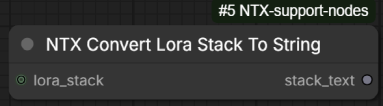

Formats a LORA_STACK as text, one LoRA per line, in the `<lora:name:model_strength:clip_strength>`
syntax (strengths rounded to 2 decimals). Entries missing a strength default to the model
strength, or to 1.0 when only the name is present.

### Inputs

| Input | Type | Description |
|---|---|---|
| `lora_stack` | LORA_STACK (optional) | The stack to format. Empty/missing produces an empty string. |

### Outputs

| Output | Type | Description |
|---|---|---|
| `stack_text` | STRING | One `<lora:...>` line per entry. |

---

## ConvertLoraStringToStack

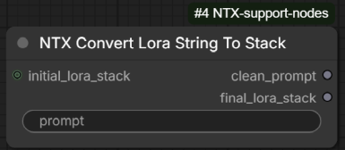

The reverse operation: parses `<lora:name:strength[:clip_strength]>` references out of a text
prompt and turns them into a LORA_STACK, returning the prompt cleaned of the tags.

- If the optional `:clip_strength` part is missing, the model strength is used for both.
- A LoRA name without extension gets `.safetensors` appended; path separators are normalised.
- The cleaned prompt has **all** `<...>` angle-bracket sections removed (not only LoRA tags),
  with leftover runs of spaces collapsed (newlines preserved).

### Inputs

| Input | Type | Description |
|---|---|---|
| `prompt` | STRING | The text to parse. |
| `initial_lora_stack` | LORA_STACK (optional) | A stack to prepend; the parsed entries are appended to it. |

### Outputs

| Output | Type | Description |
|---|---|---|
| `clean_prompt` | STRING | The prompt with the angle-bracket sections removed. |
| `final_lora_stack` | LORA_STACK | `initial_lora_stack` + the entries parsed from the prompt. |

---

## ModelInfo

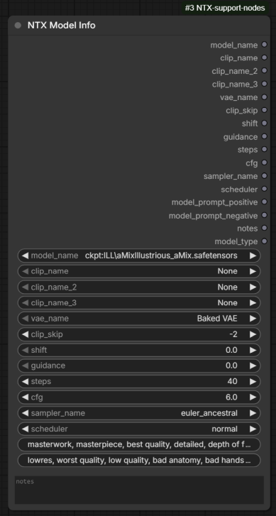

A "settings sheet" for a model: it groups the model selection and its recommended generation
parameters in one node and simply passes every value through to its outputs, so they can be
wired to loaders, samplers, etc. The values can be loaded from / saved to a **`.ntxdata`
sidecar file** stored next to the model file (see *Frontend* below).

The `model_name` combo lists both checkpoints and diffusion models, prefixed with the model
kind: `ckpt:<name>` for `models/checkpoints`, `diff:<name>` for `models/diffusion_models`.
On execution the prefix is stripped: the bare name is emitted on `model_name` and the resolved
folder type (`checkpoints` / `diffusion_models`) on `model_type`.

### Inputs

| Input | Type | Description |
|---|---|---|
| `model_name` | COMBO | The model, prefixed with `ckpt:` or `diff:`. |
| `clip_name`, `clip_name_2`, `clip_name_3` | COMBO | Up to three text encoders (`None` = unused). |
| `vae_name` | COMBO | VAE to use, or `Baked VAE` for the one embedded in the checkpoint. |
| `clip_skip` | INT | CLIP skip (≤ 0, default -1). |
| `shift` | FLOAT | Sampling shift (model-dependent). |
| `guidance` | FLOAT | Guidance value (e.g. Flux). |
| `steps` | INT | Recommended step count. |
| `cfg` | FLOAT | Recommended CFG scale. |
| `sampler_name`, `scheduler` | COMBO | Recommended sampler / scheduler. |
| `model_prompt_positive`, `model_prompt_negative` | STRING | Prompt snippets associated with the model (e.g. trigger words, quality tags). |
| `notes` | STRING (multiline) | Free-form notes about the model. |

### Outputs

Every input is repeated as an output with the same name (combos are emitted as wildcard type so
they can connect to any matching input), plus:

| Output | Type | Description |
|---|---|---|
| `model_type` | STRING | The folder type decoded from the prefix: `checkpoints` or `diffusion_models`. |

### Frontend

Right-click menu options on the node:

- **Load Model Info** — asks the backend for the data stored in the model's `.ntxdata`
  sidecar file and fills the node's widgets with it. Fields missing from the file are left
  unchanged and listed in a warning toast.
- **Save Model Info** — sends the current widget values to the backend, which writes them
  into the sidecar data. Note: the file is written with a `.ntxdata_new` extension (next to the
  model), so the existing `.ntxdata` is never overwritten directly.

---

## LoadPrompt

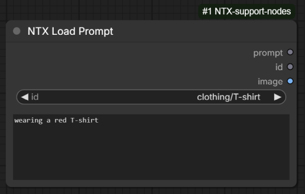

Picks a prompt from a nested, file-based prompt library and outputs its text (plus an optional
preview image). The library lives in `input/ntx_data/prompts/` and is merged from two sources:

- every `*.yaml` / `*.yml` file in the top level of that folder: dictionary keys become nested
  category paths and list items become the selectable leaves. A leaf is either a plain string
  (used as both id and prompt text, or split as `id::text`), or a dictionary with `name` (the
  id) and `positive` (the prompt) keys — any extra keys become named parameters used by the
  *LoadPromptAdvanced* variant;
- every `*.txt` file inside subdirectories of the folder: the relative path without extension
  becomes the id (e.g. `scenes/fantasy/castle.txt` → `scenes/fantasy/castle`) and the file
  content the prompt.

For example, this YAML file shows the three leaf forms:

```yaml
scenes:
  fantasy:
    - a misty castle on a cliff at dawn
    - dungeon::a torch-lit stone dungeon, dripping water, volumetric light
  sci-fi:
    - name: space station
      positive: interior of a vast orbital space station, earth visible through the windows
```

| Id | Prompt text |
|---|---|
| `scenes/fantasy/a misty castle on a cliff at dawn` | the id itself (plain string leaf) |
| `scenes/fantasy/dungeon` | `a torch-lit stone dungeon, dripping water, volumetric light` (`id::text` leaf) |
| `scenes/sci-fi/space station` | `interior of a vast orbital space station, earth visible through the windows` (dictionary leaf) |

The library is cached in memory on the backend, but the `id` combo is a **remote combo**: its
option list is fetched from the backend (which re-reads the files from disk) every time the
list is opened for the first time, its refresh button is pressed, or the node definitions are
reloaded with `R` — so prompts added on disk show up without a backend restart.

### Inputs

| Input | Type | Description |
|---|---|---|
| `id` | COMBO (remote) | The prompt id (`category/.../name`). The list is fetched from the backend on demand (see above). |
| `prompt` | STRING (multiline) | The prompt text. The frontend fills it automatically when an id is selected, and it can be freely edited afterwards. If left empty (e.g. headless/API execution), the library text for the id is used. |

### Outputs

| Output | Type | Description |
|---|---|---|
| `prompt` | STRING | The prompt text (edited value, or the library text if the box was empty). |
| `id` | STRING | The selected id. |
| `image` | IMAGE | The preview image stored next to the prompt id (same path with a `.png` / `.jpeg` / `.jpg` extension), or nothing if no such file exists. |

### Frontend

- **Shift+click** on the `id` widget opens a **tree picker** organised by category, with a
  filter box, OK/Cancel, double-click to confirm, and Enter/Escape keys. Its **Refresh** button
  makes the backend re-read the prompt files from disk and rebuilds the tree.
- The tree picker shows a **preview pane** below the tree: the library text of the highlighted
  prompt, together with its thumbnail when an image sits next to the prompt file.
- Selecting an id (from the picker or the combo) automatically fills the `prompt` textbox with
  the library text. If the current text was **edited manually** (it differs from the library
  text of the previously selected id), a confirmation dialog asks before replacing it —
  cancelling keeps the edited text while still switching the id.

Right-click menu option on the node:

- **Rebuild Prompts List from disk** — same effect as the tree picker's Refresh button:
  the backend re-reads the prompt files and the cached maps are refreshed.

The same frontend behaviour (tree picker, prompt auto-fill, RMB reload) is shared by the
**LoadPromptAdvanced** and **LoadPromptChar** variants described below.

---

## LoadPromptAdvanced

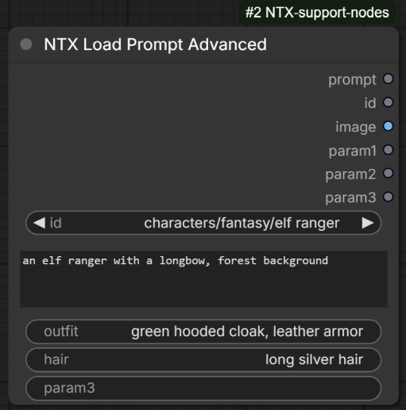

Same as **LoadPrompt**, with three extra free-form string parameters that are passed straight
through to the outputs, plus a dictionary output carrying all the extra keys of the entry.

Differences from LoadPrompt:

- three additional STRING inputs, `param1`, `param2`, `param3`, each repeated unchanged as an
  output with the same name;
- an additional `params` DICT output with **every** extra key:value pair of the selected
  library entry (empty for plain-string leaves) — useful downstream with
  **ReplaceTextParameters**, and not limited to three values or to widget renaming;
- when the selected library entry is a dictionary carrying extra keys besides `name` and
  `positive`, the frontend fills the param widgets from those keys when the id is selected.
  A widget is matched by its **current (user-facing) name**, so renaming e.g. `param2` to
  `outfit` on the node makes it pick up the entry's `outfit` value. Params the entry does not
  define are cleared.

### Example

A YAML file in the prompt library:

```yaml
characters:
  fantasy:
    - name: elf ranger
      positive: an elf ranger with a longbow, forest background
      outfit: green hooded cloak, leather armor
      hair: long silver hair
```

This defines the id `characters/fantasy/elf ranger`, whose prompt is the `positive` text and
whose extra parameters are `outfit` and `hair`. On a LoadPromptAdvanced node where `param1`
has been renamed to `outfit` and `param2` to `hair`, selecting that id fills the widgets as:

| Widget | Value after selection |
|---|---|
| `prompt` | `an elf ranger with a longbow, forest background` |
| `outfit` (renamed `param1`) | `green hooded cloak, leather armor` |
| `hair` (renamed `param2`) | `long silver hair` |
| `param3` | cleared (the entry does not define a `param3` key) |

## LoadPromptChar

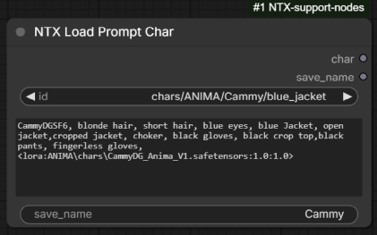

Same as **LoadPrompt**, specialised for character prompts to be saved/reused by name.

Differences from LoadPrompt:

- an additional STRING input `save_name`, passed through unchanged to the `save_name` output
  (like the params of LoadPromptAdvanced, its widget is filled from the library entry's extra
  keys when an id is selected);
- the prompt text is emitted on an output named `char` instead of `prompt`;
- there are no `id` and `image` outputs — the node outputs only `char` and `save_name`.

---

## ReplaceTextParameters

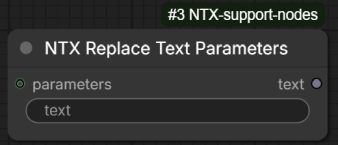

Replaces named placeholders inside a text with values taken from a parameters dictionary.
Placeholders are written as `%name%` or `%%name%%` (the double-`%%` form is resolved first,
so it survives inside text that also uses single `%` signs). A placeholder whose name is not
found in the dictionary is replaced with an **empty string**.

The special form `%date:FORMAT%` (or `%%date:FORMAT%%`) inserts the current date/time instead
of a dictionary value. `FORMAT` uses JavaScript-style tokens, converted internally to Python
`strftime`: `YYYY`/`yy` (year), `MMMM`/`MMM`/`MM` (month name / short name / number),
`DD` (day), `DDDD` (day of year), `HH` (hour), `mm` (minutes), `ss` (seconds).

### Example

With `text` = `in the style of %artist%, generated %%date:YYYY-MM-DD%%` and a `parameters`
dictionary containing `{"artist": "anime"}`, the output is
`in the style of anime, generated 2026-07-02`.

### Inputs

| Input | Type | Description |
|---|---|---|
| `text` | STRING | The text containing the placeholders. |
| `parameters` | DICT (optional) | The `{name: value}` dictionary used for the replacements. If missing, every non-date placeholder resolves to an empty string. |

### Outputs

| Output | Type | Description |
|---|---|---|
| `text` | STRING | The text with all placeholders replaced. |

---

## LazySelectAny

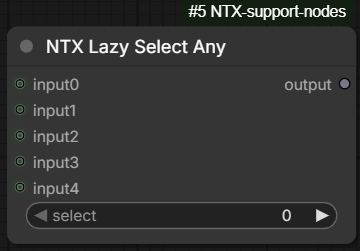

A branch selector with **lazy evaluation**: it returns the value of one of its five wildcard
inputs, chosen by index — and only the selected branch of the graph is executed. The node uses
ComfyUI's lazy-input mechanism (`check_lazy_status`) to request the evaluation of just the
selected input, so the upstream nodes feeding the unselected inputs are never run. This makes
it useful as a switch between alternative (possibly expensive) sub-graphs, e.g. two different
image-processing chains.

### Inputs

| Input | Type | Description |
|---|---|---|
| `select` | INT | Index of the input to return (0–4). |
| `input0` … `input4` | any (optional, lazy) | The selectable values. All five slots accept any data type; only the one addressed by `select` is evaluated. |

### Outputs

| Output | Type | Description |
|---|---|---|
| `output` | any | The value of the selected input (`None` if that slot is not connected). |
